# Medical Application System Overview
## Client-Facing Documentation

---

## Executive Summary

This document provides a comprehensive overview of the Medical Application System designed to streamline patient care, appointment management, and medical record keeping. The system serves three primary user roles: **Administrators**, **Doctors**, and **Patients**, each with specific functionalities tailored to their needs.

---

## System Architecture

### High-Level System Flow

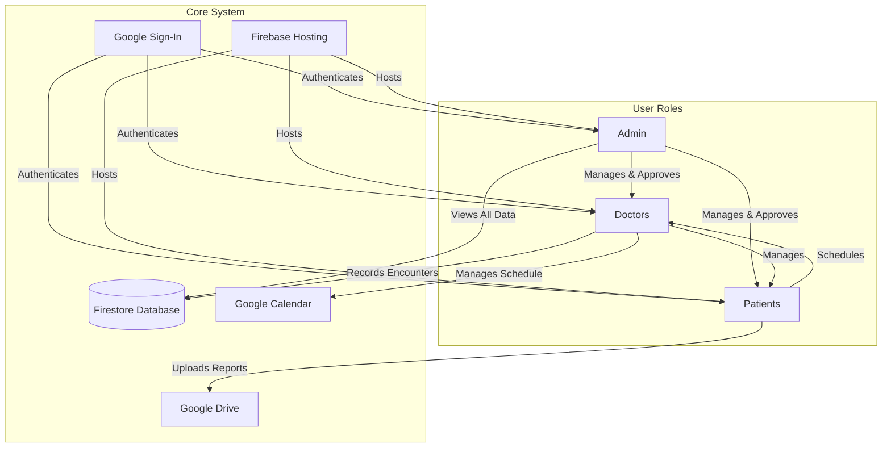

### Data Flow Diagram

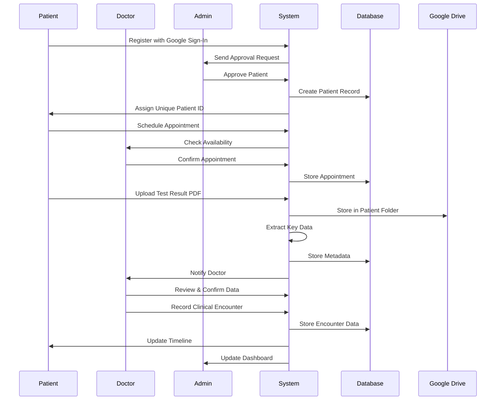

---

## User Roles and Responsibilities

### 1. Administrator Role

**Overview**: The Administrator is the system owner (typically a doctor) who oversees all operations and manages user access.

#### Key Responsibilities:
- **User Management**
  - Approve or reject Doctor registrations
  - Approve or reject Patient registrations
  - Review and verify user information before granting access
  - Manage user accounts and permissions

- **System Oversight**
  - Access all patient records and medical data
  - Access all doctor profiles and schedules
  - View comprehensive system analytics and dashboards
  - Monitor system health and usage

- **Data Access**
  - View detailed patient information (diagnosis, treatment, test results, appointments, chief complaints)
  - View detailed doctor information and patient assignments
  - Access graphical timeline views of all patient records
  - Generate system-wide reports and summaries

#### Access Method:
- Web application accessed via laptop
- Single admin Gmail account for authentication
- Full system access with no restrictions

---

### 2. Doctor Role

**Overview**: Doctors are healthcare providers who manage patient care, record clinical encounters, and maintain patient medical records.

#### Key Responsibilities:

- **Registration & Profile**
  - Register using Google Sign-In
  - Provide professional information (qualifications, specialization, contact details)
  - Wait for admin approval before gaining system access
  - Receive unique Doctor ID upon approval

- **Patient Management**
  - View all assigned patients
  - Access comprehensive patient profiles
  - View patient medical history, test results, and treatment records
  - See graphical timeline of patient's medical journey

- **Appointment Management**
  - Set availability schedule
  - Integrate with Google Calendar (or use built-in calendar)
  - View upcoming appointments
  - Manage appointment calendar

- **Clinical Documentation**
  - Record clinical encounters during patient visits
  - Document symptoms, vitals, assessments, diagnoses, and treatments
  - Prescribe medications
  - Set follow-up appointments and reminders
  - Record chief complaints and patient history

- **Test Results Review**
  - Review patient-uploaded test result PDFs
  - Confirm or edit extracted data from test results
  - View laboratory values (sugar levels, WBC, RBC, etc.)
  - Link test results to patient timeline

- **Dashboard & Analytics**
  - View summary of all patient data
  - See total encounters and follow-ups needed
  - Access charts and graphs:
    - Number of patients seen per month
    - First visit vs. repeated visit trends
    - Income vs. month
    - Disease breakdown (pie chart: vital issues, DM, HTN)
    - Number of patients awaiting follow-ups/investigations

#### Access Method:
- Web application accessed via laptop
- Google Sign-In authentication
- Access limited to assigned patients and own profile

---

### 3. Patient Role

**Overview**: Patients are the end-users who schedule appointments, upload test results, and view their medical records.

#### Key Responsibilities:

- **Registration & Profile**
  - Register using Google Sign-In
  - Provide comprehensive information:
    - Personal information (name, DOB, gender, contact details)
    - Medical information (allergies, past diagnoses, current medications)
    - Insurance information
    - Emergency contact details
    - Preferred pharmacy
    - Guardian information (if applicable)
  - Wait for admin/doctor approval
  - Receive unique Patient ID upon approval

- **Appointment Scheduling**
  - View doctor's available time slots
  - Schedule appointments with assigned doctor
  - Select date, time, and appointment duration
  - View appointment history
  - Receive appointment confirmations

- **Test Results Management**
  - Upload test result PDFs
  - Files automatically stored in Google Drive folder (named with date and Patient ID)
  - View uploaded test results
  - See extracted data from test results

- **Medical Records Access**
  - View personal medical timeline
  - See symptoms recorded by doctor
  - View prescribed medications
  - Access test results and reports
  - View appointment history

#### Access Method:
- Web application optimized for mobile devices
- Google Sign-In authentication
- Access limited to own profile and records

---

## System Features

### 1. User Authentication

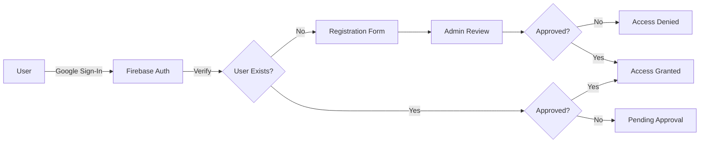

**Features:**
- Google Sign-In integration for secure authentication
- Role-based access control (Admin, Doctor, Patient)
- Admin approval workflow for new registrations
- Secure session management

---

### 2. Patient Registration Flow

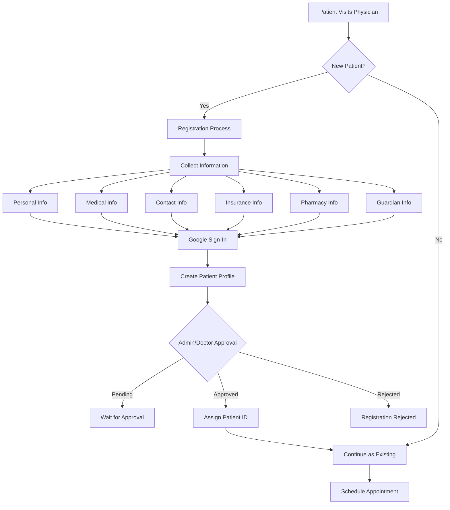

**Information Collected:**
- **Personal Information**: Full name, date of birth, gender, address, phone number, email
- **Medical Information**: Allergies, past medical history, surgical history, family history, current medications
- **Contact Information**: Primary phone, secondary phone, email, address
- **Insurance Information**: Insurance provider, policy number, group number
- **Pharmacy Information**: Preferred pharmacy name, address, phone number
- **Guardian Information**: Name, relationship, contact details (if applicable)
- **Provider Information**: Assigned doctor details

---

### 3. Appointment Scheduling System

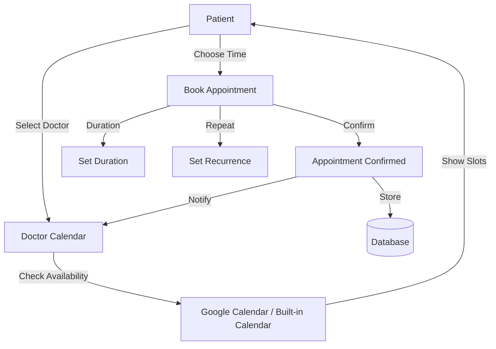

**Features:**
- View doctor's available time slots
- Book appointments with specific date and time
- Set appointment duration
- Configure recurring appointments
- Integration with Google Calendar (if available)
- Appointment reminders and notifications

---

### 4. Test Results Management

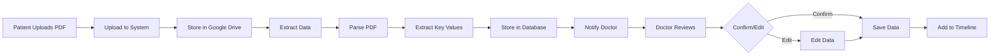

**Features:**
- PDF upload functionality
- Automatic storage in Google Drive folder (named: `YYYY-MM-DD_PatientID`)
- Data extraction from typed PDF documents:
  - Sugar levels (glucose, HbA1c)
  - Complete Blood Count (WBC, RBC, Hemoglobin, Platelets)
  - Lipid profile (Cholesterol, Triglycerides)
  - Liver function tests
  - Kidney function tests
  - Other laboratory values
- Doctor review and confirmation workflow
- Editable extracted data
- Timeline integration

---

### 5. Clinical Encounter Documentation

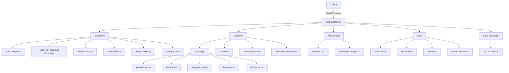

**Clinical Encounter Components:**

**Subjective:**
- Presenting complaints
- History of presenting complaints
- Medical history
- Social history
- Surgical history
- Family history

**Objective:**
- Vital signs (BP, PR, RR, Temperature, O2 Saturation)
- Laboratory data
- Radiological data
- Referrals and uploaded files

**Assessment:**
- Problem list
- Differential diagnosis (multiple options)

**Plan:**
- Treatment plan details
- Medications prescribed
- Referrals
- Patient education (dropdown list)

---

### 6. Timeline View

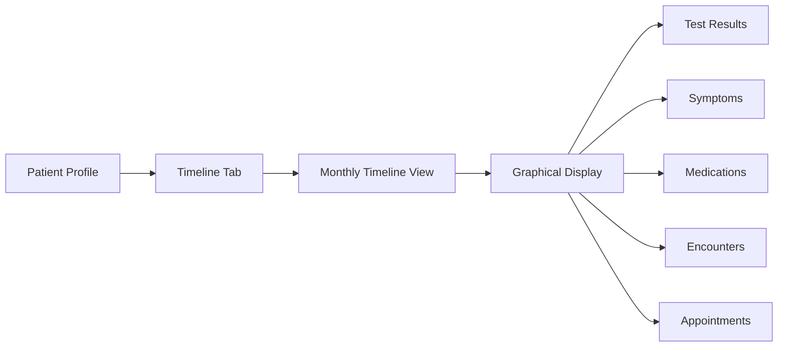

**Features:**
- Graphical timeline visualization
- Monthly view of patient history
- Color-coded events:
  - Test results (blue)
  - Symptoms (red)
  - Medications (green)
  - Clinical encounters (purple)
  - Appointments (orange)
- Interactive timeline with clickable events
- Full-screen view on laptop
- Filterable by event type
- Chronological ordering

---

### 7. Doctor Dashboard

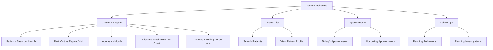

**Dashboard Components:**

**Charts:**
1. **Patients Seen per Month**: Line/bar graph showing number of patients and months
2. **First Visit vs. Repeated Visit**: Graph with Y-axis as visit type, X-axis as months
3. **Income vs. Month**: Revenue tracking over time
4. **Disease Breakdown**: Pie chart showing:
   - Vital issues
   - Diabetes Mellitus (DM)
   - Hypertension (HTN)
   - Other conditions
5. **Follow-ups Needed**: Number display (not graph) of patients awaiting follow-up visits and/or investigations

**Patient Management:**
- Search functionality
- Patient profile access
- Quick access to recent patients

---

### 8. Patient Profile View (Doctor/Admin)

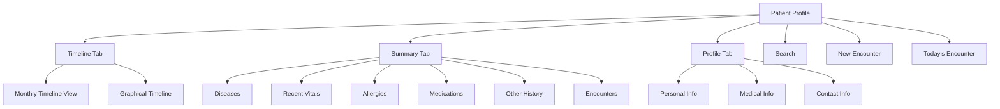

**Profile Tabs:**

1. **Timeline Tab**
   - Monthly timeline view
   - Graphical representation
   - All events (test results, symptoms, medications, encounters)
   - No treatment information in timeline (as per requirements)

2. **Summary Tab**
   - **Diseases**: List of current and past diagnoses
   - **Recent Vitals**: Latest vital signs
   - **Allergies**: Known allergies
   - **Medications**: Current and past medications
   - **Other History**: Additional medical history
   - **Encounters**: Total number of clinical encounters

3. **Profile Tab**
   - Complete patient information
   - Personal details
   - Medical history
   - Contact information
   - Insurance information

---

## Data Storage and Organization

### Google Drive Integration

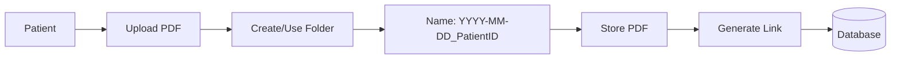

**Folder Structure:**
- Each patient has a dedicated Google Drive folder
- Folder naming convention: `YYYY-MM-DD_PatientID`
- Example: `2024-01-15_PAT001234`
- All test results and reports stored in patient's folder
- Organized by upload date

---

## Security and Privacy

### Access Control

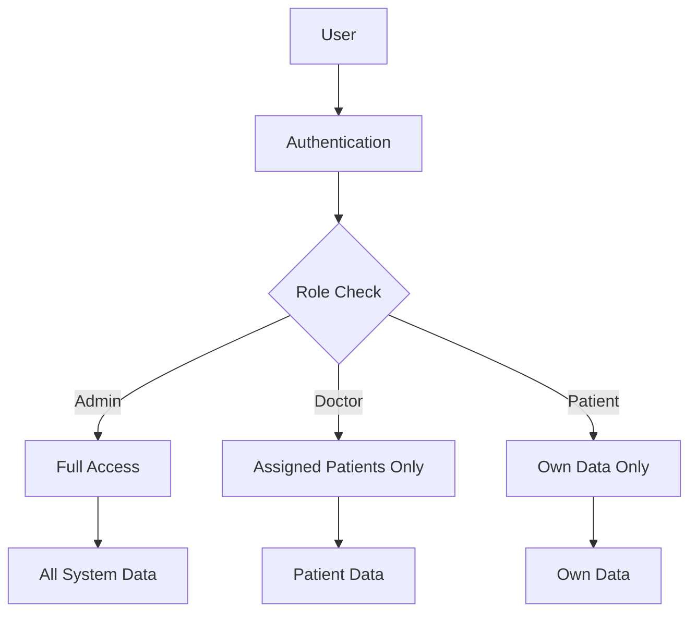

**Security Features:**
- Google Sign-In authentication
- Role-based access control
- Admin approval for new users
- Encrypted data transmission
- Secure file storage in Google Drive
- Audit trail for data access

---

## System Integration

### Technology Stack

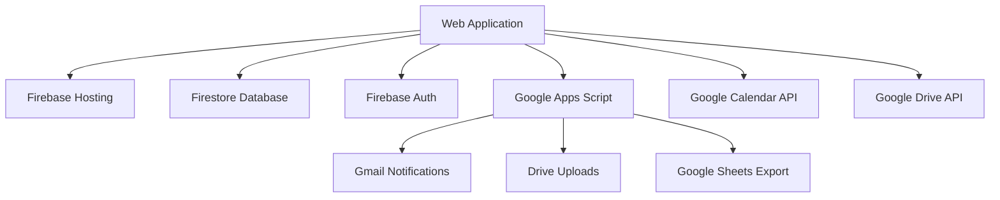

**Components:**
- **Frontend**: Web application (mobile-responsive for patients, desktop-optimized for doctors/admin)
- **Backend**: Firebase (Hosting, Firestore, Authentication)
- **Integration Layer**: Google Apps Script
- **External Services**: Google Calendar, Google Drive, Gmail

---

## Workflow Summary

### Complete Patient Journey

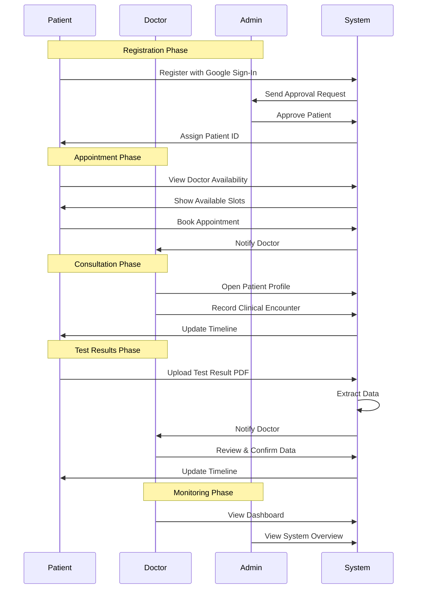

---

## Key Benefits

### For Patients
- ✅ Easy appointment scheduling
- ✅ Secure access to medical records
- ✅ Convenient test result uploads
- ✅ Mobile-friendly interface
- ✅ Complete medical history timeline

### For Doctors
- ✅ Streamlined patient management
- ✅ Comprehensive clinical documentation
- ✅ Automated test result processing
- ✅ Analytics and insights dashboard
- ✅ Calendar integration for scheduling

### For Administrators
- ✅ Complete system oversight
- ✅ User management and approval
- ✅ Comprehensive analytics
- ✅ Data security and compliance
- ✅ System-wide monitoring

---

## System Requirements

### Technical Requirements
- Modern web browser (Chrome, Firefox, Safari, Edge)
- Internet connection
- Google account for authentication
- Mobile device (for patients) or laptop (for doctors/admin)

### Functional Requirements
- Google Sign-In enabled
- Google Drive access (for file storage)
- Google Calendar access (optional, for calendar integration)

---

## Support and Maintenance

### System Maintenance
- Regular backups of Firestore database
- Google Drive folder management
- System monitoring and performance optimization
- Security updates and patches

### User Support
- Admin support for user approvals
- Technical support for system issues
- Training materials for new users
- Documentation and user guides

---

## Conclusion

This Medical Application System provides a comprehensive solution for managing patient care, appointments, and medical records. With role-based access, secure authentication, and intuitive interfaces, the system streamlines healthcare operations while maintaining data security and privacy.

The system is designed to be user-friendly for all roles, with mobile optimization for patients and desktop optimization for healthcare providers. Integration with Google services ensures seamless workflow and familiar user experience.

---

*Document Version: 1.0*  
*Last Updated: [Current Date]*

