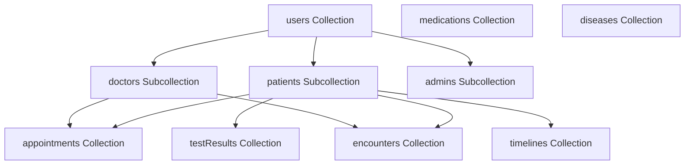
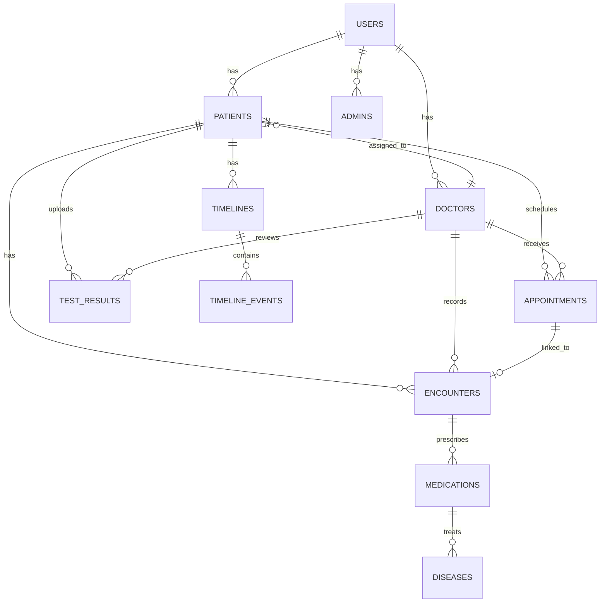

# Technical Documentation
## Medical Application System

---

## Table of Contents

1. [Technology Stack](#technology-stack)
2. [Programming Language Selection](#programming-language-selection)
3. [Firebase Database Structure](#firebase-database-structure)
4. [Data Models and Objects](#data-models-and-objects)
5. [Database Relationships](#database-relationships)
6. [Enums and Constants](#enums-and-constants)
7. [Coding Practices](#coding-practices)
8. [Security Rules](#security-rules)
9. [API Integration](#api-integration)

---

## Technology Stack

### Frontend
- **Framework**: React.js (TypeScript recommended for type safety)
- **Styling**: Tailwind CSS or Material-UI
- **State Management**: React Context API or Redux
- **Routing**: React Router
- **Form Handling**: React Hook Form
- **Charts/Graphs**: Chart.js or Recharts
- **PDF Processing**: pdf.js or pdf-lib for client-side extraction

### Backend & Services
- **Hosting**: Firebase Hosting
- **Database**: Cloud Firestore (NoSQL)
- **Authentication**: Firebase Authentication (Google Sign-In)
- **Storage**: Google Drive API (via Google Apps Script)
- **Cloud Functions**: Firebase Cloud Functions (for server-side logic)
- **Integration Layer**: Google Apps Script

### External Services
- **Calendar**: Google Calendar API
- **Email**: Gmail API (via Google Apps Script)
- **File Storage**: Google Drive API
- **Data Export**: Google Sheets API

---

## Programming Language Selection

### Recommended: TypeScript with React

**Rationale:**
- **AI-Friendly**: Excellent support in Cursor and other AI coding assistants
- **Type Safety**: Prevents common errors, especially important for medical data
- **Firebase Support**: Full TypeScript support for Firebase SDK
- **Maintainability**: Better code organization and refactoring
- **Industry Standard**: Widely used in modern web development

### Alternative: JavaScript with React

**Use if:**
- Team is more familiar with JavaScript
- Faster initial development needed
- Type safety is less critical (not recommended for medical apps)

### Code Structure Example

```typescript
// Recommended project structure
src/
  ├── components/          # Reusable UI components
  ├── pages/              # Page components
  ├── services/           # Firebase and API services
  ├── models/             # TypeScript interfaces and types
  ├── utils/              # Utility functions
  ├── hooks/              # Custom React hooks
  ├── context/            # React Context providers
  ├── enums/              # Enum definitions
  └── constants/          # Constant values
```

---

## Firebase Database Structure

### Firestore Collections Overview



---

## Data Models and Objects

### 1. Users Collection

**Collection Path**: `users/{userId}`

**Purpose**: Central user authentication and basic profile data

**Document Structure**:
```typescript
interface User {
  userId: string;                    // Auto-generated by Firebase Auth
  email: string;                      // From Google Sign-In
  role: UserRole;                     // Enum: 'admin' | 'doctor' | 'patient'
  displayName: string;                // From Google profile
  photoURL?: string;                  // From Google profile
  createdAt: Timestamp;               // Registration timestamp
  updatedAt: Timestamp;               // Last update timestamp
  isApproved: boolean;                // Admin approval status
  approvedBy?: string;                // Admin userId who approved
  approvedAt?: Timestamp;             // Approval timestamp
  status: UserStatus;                 // Enum: 'pending' | 'active' | 'suspended'
}
```

**Subcollections**:
- `patients/{patientId}` - Patient-specific data
- `doctors/{doctorId}` - Doctor-specific data
- `admins/{adminId}` - Admin-specific data

---

### 2. Patients Subcollection

**Collection Path**: `users/{userId}/patients/{patientId}`

**Purpose**: Comprehensive patient medical and personal information

**Document Structure**:
```typescript
interface Patient {
  patientId: string;                  // Unique: PAT{timestamp}{random}
  userId: string;                     // Reference to users collection
  assignedDoctorId: string;           // Reference to doctor's userId
  
  // Personal Information
  personalInfo: {
    firstName: string;
    lastName: string;
    middleName?: string;
    dateOfBirth: Date;
    gender: Gender;                   // Enum: 'male' | 'female' | 'other'
    bloodType?: BloodType;            // Enum: 'A+' | 'A-' | 'B+' | 'B-' | 'AB+' | 'AB-' | 'O+' | 'O-'
    maritalStatus?: MaritalStatus;    // Enum: 'single' | 'married' | 'divorced' | 'widowed'
    occupation?: string;
    nationality?: string;
  };
  
  // Contact Information
  contactInfo: {
    primaryPhone: string;
    secondaryPhone?: string;
    email: string;
    address: {
      street: string;
      city: string;
      state: string;
      zipCode: string;
      country: string;
    };
  };
  
  // Emergency Contact
  emergencyContact: {
    name: string;
    relationship: string;             // Enum: 'spouse' | 'parent' | 'sibling' | 'child' | 'friend' | 'other'
    phone: string;
    email?: string;
  };
  
  // Medical Information
  medicalInfo: {
    allergies: Allergy[];              // Array of allergy objects
    currentMedications: MedicationReference[];  // References to medications
    pastMedications: MedicationReference[];
    medicalHistory: MedicalHistoryItem[];
    surgicalHistory: SurgicalHistoryItem[];
    familyHistory: FamilyHistoryItem[];
    socialHistory: {
      smoking: SmokingStatus;         // Enum: 'never' | 'former' | 'current'
      alcohol: AlcoholStatus;         // Enum: 'never' | 'occasional' | 'regular' | 'heavy'
      exercise?: string;
      diet?: string;
    };
  };
  
  // Insurance Information
  insuranceInfo?: {
    provider: string;
    policyNumber: string;
    groupNumber?: string;
    effectiveDate?: Date;
    expirationDate?: Date;
  };
  
  // Pharmacy Information
  pharmacyInfo?: {
    name: string;
    address: string;
    phone: string;
  };
  
  // Guardian Information (if applicable)
  guardianInfo?: {
    name: string;
    relationship: string;
    phone: string;
    email?: string;
    address?: string;
  };
  
  // Metadata
  createdAt: Timestamp;
  updatedAt: Timestamp;
  createdBy: string;                  // Doctor or Admin userId
  isActive: boolean;
}

interface Allergy {
  allergen: string;                   // e.g., "Penicillin", "Peanuts"
  severity: AllergySeverity;          // Enum: 'mild' | 'moderate' | 'severe'
  reaction: string;                   // Description of reaction
  onsetDate?: Date;
}

interface MedicalHistoryItem {
  condition: string;                  // e.g., "Diabetes Type 2", "Hypertension"
  diagnosisDate?: Date;
  status: ConditionStatus;           // Enum: 'active' | 'resolved' | 'chronic'
  notes?: string;
}

interface SurgicalHistoryItem {
  procedure: string;
  date: Date;
  surgeon?: string;
  hospital?: string;
  notes?: string;
}

interface FamilyHistoryItem {
  relation: string;                   // e.g., "Father", "Mother", "Sibling"
  condition: string;
  ageOfOnset?: number;
  notes?: string;
}
```

---

### 3. Doctors Subcollection

**Collection Path**: `users/{userId}/doctors/{doctorId}`

**Purpose**: Doctor professional information and practice details

**Document Structure**:
```typescript
interface Doctor {
  doctorId: string;                   // Unique: DOC{timestamp}{random}
  userId: string;                     // Reference to users collection
  
  // Professional Information
  professionalInfo: {
    firstName: string;
    lastName: string;
    middleName?: string;
    title: string;                    // e.g., "Dr.", "MD", "MBBS"
    specialization: string;           // e.g., "General Practice", "Cardiology"
    qualifications: string[];         // Array of degrees/certifications
    licenseNumber: string;
    licenseExpiry?: Date;
    yearsOfExperience?: number;
  };
  
  // Contact Information
  contactInfo: {
    primaryPhone: string;
    secondaryPhone?: string;
    email: string;
    address?: {
      street: string;
      city: string;
      state: string;
      zipCode: string;
    };
  };
  
  // Practice Information
  practiceInfo: {
    clinicName?: string;
    clinicAddress?: string;
    consultationFee?: number;
    currency?: string;                 // Default: "USD"
  };
  
  // Availability
  availability: {
    workingDays: DayOfWeek[];         // Array of days: 'monday' | 'tuesday' | etc.
    workingHours: {
      start: string;                   // Format: "HH:mm" (24-hour)
      end: string;
    };
    timeSlots: TimeSlot[];             // Available appointment slots
    timeZone: string;                  // e.g., "America/New_York"
  };
  
  // Calendar Integration
  calendarIntegration?: {
    googleCalendarId?: string;
    isIntegrated: boolean;
    syncEnabled: boolean;
  };
  
  // Patient Assignments
  assignedPatients: string[];          // Array of patientIds
  
  // Metadata
  createdAt: Timestamp;
  updatedAt: Timestamp;
  isActive: boolean;
}

interface TimeSlot {
  dayOfWeek: DayOfWeek;
  startTime: string;                  // Format: "HH:mm"
  endTime: string;
  duration: number;                    // Minutes (e.g., 15, 30, 60)
  isAvailable: boolean;
}
```

---

### 4. Admins Subcollection

**Collection Path**: `users/{userId}/admins/{adminId}`

**Purpose**: Administrator account information

**Document Structure**:
```typescript
interface Admin {
  adminId: string;                     // Unique: ADM{timestamp}{random}
  userId: string;                      // Reference to users collection
  
  // Personal Information
  personalInfo: {
    firstName: string;
    lastName: string;
    email: string;                     // Must match admin Gmail account
    phone?: string;
  };
  
  // System Access
  permissions: {
    canApproveUsers: boolean;
    canViewAllData: boolean;
    canManageSystem: boolean;
    canExportData: boolean;
  };
  
  // Metadata
  createdAt: Timestamp;
  updatedAt: Timestamp;
  isActive: boolean;
}
```

---

### 5. Appointments Collection

**Collection Path**: `appointments/{appointmentId}`

**Purpose**: Appointment scheduling and management

**Document Structure**:
```typescript
interface Appointment {
  appointmentId: string;               // Auto-generated
  patientId: string;                   // Reference to patient
  doctorId: string;                    // Reference to doctor
  userId: string;                      // Patient's userId
  
  // Scheduling
  dateTime: Timestamp;                 // Appointment date and time
  duration: number;                    // Minutes
  timeZone: string;
  
  // Appointment Details
  type: AppointmentType;               // Enum: 'consultation' | 'follow-up' | 'checkup' | 'emergency'
  reason?: string;                     // Patient's reason for visit
  status: AppointmentStatus;           // Enum: 'scheduled' | 'confirmed' | 'completed' | 'cancelled' | 'no-show'
  
  // Recurrence (if applicable)
  recurrence?: {
    pattern: RecurrencePattern;       // Enum: 'none' | 'daily' | 'weekly' | 'monthly'
    endDate?: Date;
    occurrences?: number;
  };
  
  // Calendar Integration
  googleCalendarEventId?: string;
  
  // Notes
  notes?: string;
  cancellationReason?: string;
  
  // Metadata
  createdAt: Timestamp;
  updatedAt: Timestamp;
  createdBy: string;                   // Patient userId
  cancelledBy?: string;
  cancelledAt?: Timestamp;
}
```

---

### 6. Encounters Collection

**Collection Path**: `encounters/{encounterId}`

**Purpose**: Clinical encounter documentation (SOAP notes)

**Document Structure**:
```typescript
interface Encounter {
  encounterId: string;                 // Auto-generated
  patientId: string;                   // Reference to patient
  doctorId: string;                    // Reference to doctor
  appointmentId?: string;              // Reference to appointment (if linked)
  
  // Encounter Details
  encounterDate: Timestamp;
  encounterType: EncounterType;        // Enum: 'initial' | 'follow-up' | 'emergency' | 'telemedicine'
  
  // Subjective (S)
  subjective: {
    chiefComplaint: string;            // Primary reason for visit
    historyOfPresentingComplaint: string;
    medicalHistory: string;
    socialHistory: string;
    surgicalHistory: string;
    familyHistory: string;
    reviewOfSystems?: string;          // System review
  };
  
  // Objective (O)
  objective: {
    vitalSigns: VitalSigns;
    physicalExamination?: string;
    labData?: LabDataReference[];      // References to test results
    radiologicalData?: RadiologyReference[];
    referrals?: ReferralReference[];
    uploadedFiles?: FileReference[];
  };
  
  // Assessment (A)
  assessment: {
    problems: Problem[];               // Problem list
    differentialDiagnosis?: DifferentialDiagnosis[];
    icd10Codes?: string[];             // ICD-10 diagnosis codes
  };
  
  // Plan (P)
  plan: {
    treatmentPlan: string;
    medications: MedicationPrescription[];
    referrals?: Referral[];
    patientEducation?: PatientEducation[];
    followUp?: FollowUpPlan;
  };
  
  // Metadata
  createdAt: Timestamp;
  updatedAt: Timestamp;
  createdBy: string;                   // Doctor userId
  isDraft: boolean;                    // If encounter is not finalized
}

interface VitalSigns {
  bloodPressure?: {
    systolic: number;
    diastolic: number;
    unit: string;                      // Default: "mmHg"
  };
  pulseRate?: {
    value: number;
    unit: string;                      // Default: "bpm"
  };
  respiratoryRate?: {
    value: number;
    unit: string;                      // Default: "breaths/min"
  };
  temperature?: {
    value: number;
    unit: string;                      // Default: "°C" or "°F"
  };
  oxygenSaturation?: {
    value: number;
    unit: string;                      // Default: "%"
  };
  weight?: {
    value: number;
    unit: string;                      // Default: "kg"
  };
  height?: {
    value: number;
    unit: string;                      // Default: "cm"
  };
  bmi?: number;                        // Calculated from weight and height
}

interface Problem {
  problemId: string;                   // Auto-generated
  description: string;
  status: ProblemStatus;               // Enum: 'active' | 'resolved' | 'chronic'
  onsetDate?: Date;
  icd10Code?: string;
}

interface DifferentialDiagnosis {
  diagnosis: string;
  probability: number;                 // 0-100 (percentage)
  notes?: string;
}

interface MedicationPrescription {
  medicationId: string;                // Reference to medications collection
  name: string;
  dosage: string;                      // e.g., "500mg"
  frequency: string;                   // e.g., "twice daily", "once daily"
  duration: string;                    // e.g., "7 days", "2 weeks"
  instructions?: string;               // Additional instructions
  startDate: Date;
  endDate?: Date;
  isActive: boolean;
}

interface Referral {
  referralId: string;                  // Auto-generated
  type: ReferralType;                  // Enum: 'specialist' | 'laboratory' | 'radiology' | 'hospital'
  specialistName?: string;
  facilityName: string;
  reason: string;
  priority: ReferralPriority;           // Enum: 'routine' | 'urgent' | 'emergency'
  date?: Date;
}

interface PatientEducation {
  topic: string;                       // From dropdown list
  description?: string;
  materials?: string[];                // Links or file references
}

interface FollowUpPlan {
  isRequired: boolean;
  followUpDate?: Date;
  followUpType?: string;               // e.g., "in-person", "telemedicine"
  reason?: string;
  reminders?: boolean;
}
```

---

### 7. Test Results Collection

**Collection Path**: `testResults/{testResultId}`

**Purpose**: Laboratory test results and extracted data

**Document Structure**:
```typescript
interface TestResult {
  testResultId: string;                // Auto-generated
  patientId: string;                   // Reference to patient
  doctorId?: string;                   // Assigned doctor (if applicable)
  
  // File Information
  fileInfo: {
    fileName: string;
    fileType: string;                  // "application/pdf"
    fileSize: number;                  // Bytes
    uploadDate: Timestamp;
    googleDriveFileId: string;         // Google Drive file ID
    googleDriveUrl: string;            // Direct link to file
    folderPath: string;                // Drive folder path
  };
  
  // Extracted Data
  extractedData: {
    isExtracted: boolean;               // Whether extraction was attempted
    extractionDate?: Timestamp;
    extractionMethod?: string;          // e.g., "pdf-parse", "ocr"
    rawText?: string;                  // Extracted raw text from PDF
    confirmed: boolean;                // Whether doctor confirmed
    confirmedBy?: string;              // Doctor userId
    confirmedAt?: Timestamp;
  };
  
  // Laboratory Values
  labValues: LabValue[];
  
  // Test Information
  testInfo: {
    testName: string;                  // e.g., "Complete Blood Count", "Lipid Profile"
    testDate?: Date;                   // Date test was performed
    orderedBy?: string;                // Doctor name
    labName?: string;                  // Laboratory name
  };
  
  // Metadata
  createdAt: Timestamp;
  updatedAt: Timestamp;
  uploadedBy: string;                  // Patient userId
}

interface LabValue {
  testName: string;                    // e.g., "Glucose", "WBC", "RBC", "Hemoglobin"
  value: number | string;              // Numeric value or text result
  unit: string;                        // e.g., "mg/dL", "cells/μL", "g/dL"
  referenceRange?: {
    min: number;
    max: number;
    unit: string;
  };
  status: LabValueStatus;              // Enum: 'normal' | 'high' | 'low' | 'critical'
  notes?: string;
  isConfirmed: boolean;                // Doctor confirmation
}
```

---

### 8. Medications Collection

**Collection Path**: `medications/{medicationId}`

**Purpose**: Medication master list and prescriptions

**Document Structure**:
```typescript
interface Medication {
  medicationId: string;                // Auto-generated
  name: string;                         // Generic or brand name
  genericName?: string;
  brandName?: string;
  
  // Medication Details
  category: MedicationCategory;        // Enum: 'antibiotic' | 'antihypertensive' | 'antidiabetic' | etc.
  form: MedicationForm;                // Enum: 'tablet' | 'capsule' | 'syrup' | 'injection' | etc.
  strength?: string;                   // e.g., "500mg", "10mg/ml"
  
  // Prescription Information
  prescriptionInfo?: {
    dosageOptions: string[];           // Common dosages
    frequencyOptions: string[];        // Common frequencies
    durationOptions: string[];         // Common durations
  };
  
  // Safety Information
  contraindications?: string[];
  sideEffects?: string[];
  interactions?: string[];
  
  // Metadata
  createdAt: Timestamp;
  updatedAt: Timestamp;
  isActive: boolean;
}
```

---

### 9. Diseases Collection

**Collection Path**: `diseases/{diseaseId}`

**Purpose**: Disease master list with ICD-10 codes

**Document Structure**:
```typescript
interface Disease {
  diseaseId: string;                   // Auto-generated
  name: string;                        // Disease name
  icd10Code: string;                   // ICD-10 classification code
  category: DiseaseCategory;           // Enum: 'infectious' | 'cardiovascular' | 'endocrine' | etc.
  description?: string;
  symptoms?: string[];
  treatments?: string[];
  
  // Metadata
  createdAt: Timestamp;
  updatedAt: Timestamp;
  isActive: boolean;
}
```

---

### 10. Timelines Collection

**Collection Path**: `timelines/{timelineId}`

**Purpose**: Patient medical timeline for graphical display

**Document Structure**:
```typescript
interface Timeline {
  timelineId: string;                  // Auto-generated
  patientId: string;                   // Reference to patient
  
  // Timeline Events
  events: TimelineEvent[];
  
  // Metadata
  createdAt: Timestamp;
  updatedAt: Timestamp;
}

interface TimelineEvent {
  eventId: string;                     // Auto-generated
  eventType: TimelineEventType;        // Enum: 'appointment' | 'encounter' | 'test_result' | 'medication' | 'symptom'
  date: Timestamp;
  title: string;
  description?: string;
  
  // Event-Specific Data
  eventData: {
    // For appointments
    appointmentId?: string;
    
    // For encounters
    encounterId?: string;
    chiefComplaint?: string;
    
    // For test results
    testResultId?: string;
    testName?: string;
    
    // For medications
    medicationId?: string;
    medicationName?: string;
    
    // For symptoms
    symptom?: string;
  };
  
  // Display Properties
  color?: string;                      // Color code for timeline display
  icon?: string;                       // Icon identifier
}
```

---

## Database Relationships

### Relationship Diagram



### Relationship Implementation

**1. User to Patient/Doctor/Admin**
- One-to-One relationship
- `users/{userId}` contains basic auth data
- `users/{userId}/patients/{patientId}` or `users/{userId}/doctors/{doctorId}` contains role-specific data
- Use `userId` as the linking field

**2. Patient to Doctor**
- Many-to-One relationship
- `patient.assignedDoctorId` references `doctor.userId`
- Use for filtering and queries

**3. Patient to Appointments**
- One-to-Many relationship
- `appointments` collection contains `patientId` field
- Query: `appointments.where('patientId', '==', patientId)`

**4. Doctor to Appointments**
- One-to-Many relationship
- `appointments` collection contains `doctorId` field
- Query: `appointments.where('doctorId', '==', doctorId)`

**5. Patient to Encounters**
- One-to-Many relationship
- `encounters` collection contains `patientId` field
- Optional link to `appointmentId`

**6. Patient to Test Results**
- One-to-Many relationship
- `testResults` collection contains `patientId` field

**7. Patient to Timeline**
- One-to-One relationship
- Each patient has one timeline document
- Timeline contains array of events

**8. Encounters to Medications**
- Many-to-Many relationship
- `encounters.plan.medications[]` contains medication references
- Medications stored in separate collection for reuse

---

## Enums and Constants

### Enum Definitions

**File**: `src/enums/index.ts`

```typescript
// User Roles
export enum UserRole {
  ADMIN = 'admin',
  DOCTOR = 'doctor',
  PATIENT = 'patient'
}

// User Status
export enum UserStatus {
  PENDING = 'pending',
  ACTIVE = 'active',
  SUSPENDED = 'suspended'
}

// Gender
export enum Gender {
  MALE = 'male',
  FEMALE = 'female',
  OTHER = 'other'
}

// Blood Type
export enum BloodType {
  A_POSITIVE = 'A+',
  A_NEGATIVE = 'A-',
  B_POSITIVE = 'B+',
  B_NEGATIVE = 'B-',
  AB_POSITIVE = 'AB+',
  AB_NEGATIVE = 'AB-',
  O_POSITIVE = 'O+',
  O_NEGATIVE = 'O-'
}

// Marital Status
export enum MaritalStatus {
  SINGLE = 'single',
  MARRIED = 'married',
  DIVORCED = 'divorced',
  WIDOWED = 'widowed'
}

// Allergy Severity
export enum AllergySeverity {
  MILD = 'mild',
  MODERATE = 'moderate',
  SEVERE = 'severe'
}

// Condition Status
export enum ConditionStatus {
  ACTIVE = 'active',
  RESOLVED = 'resolved',
  CHRONIC = 'chronic'
}

// Smoking Status
export enum SmokingStatus {
  NEVER = 'never',
  FORMER = 'former',
  CURRENT = 'current'
}

// Alcohol Status
export enum AlcoholStatus {
  NEVER = 'never',
  OCCASIONAL = 'occasional',
  REGULAR = 'regular',
  HEAVY = 'heavy'
}

// Day of Week
export enum DayOfWeek {
  MONDAY = 'monday',
  TUESDAY = 'tuesday',
  WEDNESDAY = 'wednesday',
  THURSDAY = 'thursday',
  FRIDAY = 'friday',
  SATURDAY = 'saturday',
  SUNDAY = 'sunday'
}

// Appointment Type
export enum AppointmentType {
  CONSULTATION = 'consultation',
  FOLLOW_UP = 'follow-up',
  CHECKUP = 'checkup',
  EMERGENCY = 'emergency'
}

// Appointment Status
export enum AppointmentStatus {
  SCHEDULED = 'scheduled',
  CONFIRMED = 'confirmed',
  COMPLETED = 'completed',
  CANCELLED = 'cancelled',
  NO_SHOW = 'no-show'
}

// Recurrence Pattern
export enum RecurrencePattern {
  NONE = 'none',
  DAILY = 'daily',
  WEEKLY = 'weekly',
  MONTHLY = 'monthly'
}

// Encounter Type
export enum EncounterType {
  INITIAL = 'initial',
  FOLLOW_UP = 'follow-up',
  EMERGENCY = 'emergency',
  TELEMEDICINE = 'telemedicine'
}

// Problem Status
export enum ProblemStatus {
  ACTIVE = 'active',
  RESOLVED = 'resolved',
  CHRONIC = 'chronic'
}

// Referral Type
export enum ReferralType {
  SPECIALIST = 'specialist',
  LABORATORY = 'laboratory',
  RADIOLOGY = 'radiology',
  HOSPITAL = 'hospital'
}

// Referral Priority
export enum ReferralPriority {
  ROUTINE = 'routine',
  URGENT = 'urgent',
  EMERGENCY = 'emergency'
}

// Lab Value Status
export enum LabValueStatus {
  NORMAL = 'normal',
  HIGH = 'high',
  LOW = 'low',
  CRITICAL = 'critical'
}

// Medication Category
export enum MedicationCategory {
  ANTIBIOTIC = 'antibiotic',
  ANTIHYPERTENSIVE = 'antihypertensive',
  ANTIDIABETIC = 'antidiabetic',
  ANALGESIC = 'analgesic',
  ANTIPYRETIC = 'antipyretic',
  VITAMIN = 'vitamin',
  SUPPLEMENT = 'supplement',
  OTHER = 'other'
}

// Medication Form
export enum MedicationForm {
  TABLET = 'tablet',
  CAPSULE = 'capsule',
  SYRUP = 'syrup',
  INJECTION = 'injection',
  CREAM = 'cream',
  OINTMENT = 'ointment',
  DROPS = 'drops',
  INHALER = 'inhaler',
  OTHER = 'other'
}

// Disease Category
export enum DiseaseCategory {
  INFECTIOUS = 'infectious',
  CARDIOVASCULAR = 'cardiovascular',
  ENDOCRINE = 'endocrine',
  RESPIRATORY = 'respiratory',
  GASTROINTESTINAL = 'gastrointestinal',
  NEUROLOGICAL = 'neurological',
  MUSCULOSKELETAL = 'musculoskeletal',
  MENTAL_HEALTH = 'mental_health',
  OTHER = 'other'
}

// Timeline Event Type
export enum TimelineEventType {
  APPOINTMENT = 'appointment',
  ENCOUNTER = 'encounter',
  TEST_RESULT = 'test_result',
  MEDICATION = 'medication',
  SYMPTOM = 'symptom'
}
```

### Constants

**File**: `src/constants/index.ts`

```typescript
// ID Prefixes
export const ID_PREFIXES = {
  PATIENT: 'PAT',
  DOCTOR: 'DOC',
  ADMIN: 'ADM',
  APPOINTMENT: 'APT',
  ENCOUNTER: 'ENC',
  TEST_RESULT: 'TST',
  MEDICATION: 'MED',
  DISEASE: 'DIS',
  TIMELINE: 'TLN'
} as const;

// Default Values
export const DEFAULTS = {
  APPOINTMENT_DURATION: 30,           // minutes
  TIME_ZONE: 'UTC',
  CURRENCY: 'USD',
  DATE_FORMAT: 'YYYY-MM-DD',
  TIME_FORMAT: 'HH:mm'
} as const;

// File Upload Limits
export const UPLOAD_LIMITS = {
  MAX_FILE_SIZE: 10 * 1024 * 1024,    // 10MB
  ALLOWED_TYPES: ['application/pdf'],
  MAX_FILES_PER_UPLOAD: 5
} as const;

// Pagination
export const PAGINATION = {
  DEFAULT_PAGE_SIZE: 20,
  MAX_PAGE_SIZE: 100
} as const;

// Timeline Colors
export const TIMELINE_COLORS = {
  APPOINTMENT: '#FF9800',             // Orange
  ENCOUNTER: '#9C27B0',                // Purple
  TEST_RESULT: '#2196F3',              // Blue
  MEDICATION: '#4CAF50',               // Green
  SYMPTOM: '#F44336'                   // Red
} as const;
```

---

## Coding Practices

### 1. Encapsulation

**Service Layer Pattern**:
```typescript
// src/services/PatientService.ts
export class PatientService {
  private db: Firestore;
  
  constructor(db: Firestore) {
    this.db = db;
  }
  
  // Private method - internal use only
  private generatePatientId(): string {
    const timestamp = Date.now();
    const random = Math.floor(Math.random() * 1000);
    return `${ID_PREFIXES.PATIENT}${timestamp}${random}`;
  }
  
  // Public method - exposed API
  async createPatient(userId: string, data: Partial<Patient>): Promise<Patient> {
    const patientId = this.generatePatientId();
    const patient: Patient = {
      patientId,
      userId,
      ...data,
      createdAt: Timestamp.now(),
      updatedAt: Timestamp.now(),
      isActive: true
    };
    
    await this.db
      .collection('users')
      .doc(userId)
      .collection('patients')
      .doc(patientId)
      .set(patient);
    
    return patient;
  }
  
  // Public method with validation
  async getPatient(patientId: string, userId: string): Promise<Patient | null> {
    const doc = await this.db
      .collection('users')
      .doc(userId)
      .collection('patients')
      .doc(patientId)
      .get();
    
    if (!doc.exists) {
      return null;
    }
    
    return doc.data() as Patient;
  }
}
```

### 2. Type Safety

**Use TypeScript Interfaces**:
```typescript
// src/models/Patient.ts
export interface Patient {
  patientId: string;
  userId: string;
  // ... rest of interface
}

// Usage with type checking
const patient: Patient = await patientService.getPatient(patientId, userId);
```

### 3. Error Handling

**Custom Error Classes**:
```typescript
// src/utils/errors.ts
export class PatientNotFoundError extends Error {
  constructor(patientId: string) {
    super(`Patient with ID ${patientId} not found`);
    this.name = 'PatientNotFoundError';
  }
}

export class UnauthorizedError extends Error {
  constructor() {
    super('Unauthorized access');
    this.name = 'UnauthorizedError';
  }
}

// Usage
try {
  const patient = await patientService.getPatient(patientId, userId);
  if (!patient) {
    throw new PatientNotFoundError(patientId);
  }
} catch (error) {
  if (error instanceof PatientNotFoundError) {
    // Handle patient not found
  }
}
```

### 4. Validation

**Input Validation**:
```typescript
// src/utils/validation.ts
import { z } from 'zod';  // or use Yup, Joi, etc.

export const PatientSchema = z.object({
  personalInfo: z.object({
    firstName: z.string().min(1).max(50),
    lastName: z.string().min(1).max(50),
    dateOfBirth: z.date(),
    gender: z.nativeEnum(Gender)
  }),
  contactInfo: z.object({
    primaryPhone: z.string().regex(/^\+?[1-9]\d{1,14}$/),
    email: z.string().email()
  })
});

// Usage
const validatedData = PatientSchema.parse(patientData);
```

### 5. Repository Pattern

**Data Access Layer**:
```typescript
// src/repositories/PatientRepository.ts
export class PatientRepository {
  constructor(private db: Firestore) {}
  
  async create(patient: Patient): Promise<void> {
    await this.db
      .collection('users')
      .doc(patient.userId)
      .collection('patients')
      .doc(patient.patientId)
      .set(patient);
  }
  
  async findById(patientId: string, userId: string): Promise<Patient | null> {
    const doc = await this.db
      .collection('users')
      .doc(userId)
      .collection('patients')
      .doc(patientId)
      .get();
    
    return doc.exists ? (doc.data() as Patient) : null;
  }
  
  async findByDoctor(doctorId: string): Promise<Patient[]> {
    const snapshot = await this.db
      .collectionGroup('patients')
      .where('assignedDoctorId', '==', doctorId)
      .get();
    
    return snapshot.docs.map(doc => doc.data() as Patient);
  }
}
```

### 6. Custom Hooks (React)

**Reusable Logic**:
```typescript
// src/hooks/usePatient.ts
export function usePatient(patientId: string, userId: string) {
  const [patient, setPatient] = useState<Patient | null>(null);
  const [loading, setLoading] = useState(true);
  const [error, setError] = useState<Error | null>(null);
  
  useEffect(() => {
    const fetchPatient = async () => {
      try {
        setLoading(true);
        const data = await patientService.getPatient(patientId, userId);
        setPatient(data);
      } catch (err) {
        setError(err as Error);
      } finally {
        setLoading(false);
      }
    };
    
    fetchPatient();
  }, [patientId, userId]);
  
  return { patient, loading, error };
}
```

---

## Security Rules

### Firestore Security Rules

**File**: `firestore.rules`

```javascript
rules_version = '2';
service cloud.firestore {
  match /databases/{database}/documents {
    
    // Helper functions
    function isAuthenticated() {
      return request.auth != null;
    }
    
    function isAdmin() {
      return isAuthenticated() && 
             get(/databases/$(database)/documents/users/$(request.auth.uid)).data.role == 'admin';
    }
    
    function isDoctor() {
      return isAuthenticated() && 
             get(/databases/$(database)/documents/users/$(request.auth.uid)).data.role == 'doctor';
    }
    
    function isPatient() {
      return isAuthenticated() && 
             get(/databases/$(database)/documents/users/$(request.auth.uid)).data.role == 'patient';
    }
    
    function isOwner(userId) {
      return isAuthenticated() && request.auth.uid == userId;
    }
    
    // Users collection
    match /users/{userId} {
      allow read: if isAuthenticated() && (isOwner(userId) || isAdmin());
      allow write: if isAdmin() || isOwner(userId);
      
      // Patients subcollection
      match /patients/{patientId} {
        allow read: if isAuthenticated() && (
          isOwner(userId) || 
          isAdmin() || 
          (isDoctor() && resource.data.assignedDoctorId == get(/databases/$(database)/documents/users/$(request.auth.uid)).data.userId)
        );
        allow write: if isAdmin() || (isDoctor() && request.resource.data.assignedDoctorId == get(/databases/$(database)/documents/users/$(request.auth.uid)).data.userId);
      }
      
      // Doctors subcollection
      match /doctors/{doctorId} {
        allow read: if isAuthenticated() && (isOwner(userId) || isAdmin());
        allow write: if isAdmin() || isOwner(userId);
      }
      
      // Admins subcollection
      match /admins/{adminId} {
        allow read, write: if isAdmin();
      }
    }
    
    // Appointments collection
    match /appointments/{appointmentId} {
      allow read: if isAuthenticated() && (
        isAdmin() || 
        isOwner(resource.data.userId) || 
        (isDoctor() && resource.data.doctorId == get(/databases/$(database)/documents/users/$(request.auth.uid)).data.userId)
      );
      allow create: if isAuthenticated() && (
        isPatient() || 
        isAdmin() || 
        (isDoctor() && request.resource.data.doctorId == get(/databases/$(database)/documents/users/$(request.auth.uid)).data.userId)
      );
      allow update, delete: if isAuthenticated() && (
        isAdmin() || 
        isOwner(resource.data.userId) || 
        (isDoctor() && resource.data.doctorId == get(/databases/$(database)/documents/users/$(request.auth.uid)).data.userId)
      );
    }
    
    // Encounters collection
    match /encounters/{encounterId} {
      allow read: if isAuthenticated() && (
        isAdmin() || 
        isOwner(resource.data.patientId) || 
        (isDoctor() && resource.data.doctorId == get(/databases/$(database)/documents/users/$(request.auth.uid)).data.userId)
      );
      allow create, update: if isAuthenticated() && (
        isAdmin() || 
        (isDoctor() && request.resource.data.doctorId == get(/databases/$(database)/documents/users/$(request.auth.uid)).data.userId)
      );
      allow delete: if isAdmin();
    }
    
    // Test Results collection
    match /testResults/{testResultId} {
      allow read: if isAuthenticated() && (
        isAdmin() || 
        isOwner(resource.data.patientId) || 
        (isDoctor() && resource.data.doctorId == get(/databases/$(database)/documents/users/$(request.auth.uid)).data.userId)
      );
      allow create: if isAuthenticated() && (
        isPatient() || 
        isAdmin() || 
        (isDoctor() && request.resource.data.doctorId == get(/databases/$(database)/documents/users/$(request.auth.uid)).data.userId)
      );
      allow update: if isAuthenticated() && (
        isAdmin() || 
        (isDoctor() && resource.data.doctorId == get(/databases/$(database)/documents/users/$(request.auth.uid)).data.userId)
      );
    }
    
    // Medications collection
    match /medications/{medicationId} {
      allow read: if isAuthenticated();
      allow write: if isAdmin();
    }
    
    // Diseases collection
    match /diseases/{diseaseId} {
      allow read: if isAuthenticated();
      allow write: if isAdmin();
    }
    
    // Timelines collection
    match /timelines/{timelineId} {
      allow read: if isAuthenticated() && (
        isAdmin() || 
        isOwner(resource.data.patientId) || 
        (isDoctor() && get(/databases/$(database)/documents/users/$(request.auth.uid)).data.userId in resource.data.assignedDoctorId)
      );
      allow write: if isAdmin() || isDoctor();
    }
  }
}
```

---

## API Integration

### Google Apps Script Integration

**Purpose**: Bridge between Firebase and Google Services

**Functions**:
1. **Gmail Notifications**: Send email notifications for appointments, approvals, etc.
2. **Drive Uploads**: Handle file uploads to Google Drive
3. **Calendar Sync**: Sync appointments with Google Calendar
4. **Sheets Export**: Export data to Google Sheets for reporting

**Example Structure**:
```javascript
// Google Apps Script
function handleTestResultUpload(fileData, patientId, userId) {
  // 1. Create/Get Drive folder for patient
  const folderName = `${new Date().toISOString().split('T')[0]}_${patientId}`;
  const folder = getOrCreateFolder(folderName);
  
  // 2. Upload PDF to Drive
  const file = folder.createFile(fileData);
  
  // 3. Extract text from PDF (basic extraction)
  const text = extractTextFromPDF(file);
  
  // 4. Return file ID and extracted text
  return {
    fileId: file.getId(),
    fileUrl: file.getUrl(),
    extractedText: text
  };
}
```

---

## Best Practices Summary

1. **Always use TypeScript** for type safety
2. **Implement proper error handling** with custom error classes
3. **Validate all inputs** before database operations
4. **Use enums** for fixed value sets
5. **Encapsulate business logic** in service classes
6. **Separate data access** in repository classes
7. **Implement security rules** for all collections
8. **Use transactions** for multi-document operations
9. **Implement pagination** for large data sets
10. **Log all critical operations** for auditing
11. **Use indexes** for frequently queried fields
12. **Implement caching** where appropriate
13. **Follow RESTful patterns** for API design
14. **Write unit tests** for business logic
15. **Document all public APIs**

---

*Document Version: 1.0*  
*Last Updated: [Current Date]*

